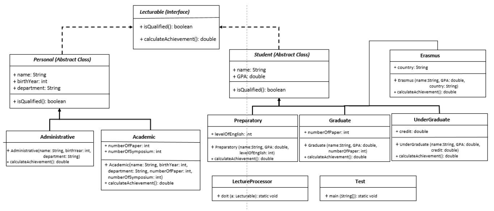

#Project Name: Homework2
Note 1: qualified refers to a method called isQualified which calls calculateAchievement, and if it’s value greather than the limit returns true else returns false.
limits: Student: 100, Personal: 1

Note 2: For each class, calculateAchievement works differently. 
	_in Academic:
	   ((3 * numberOfPaper) + (2 * numberOfSymposium)) / age         
                 // you must calculate the age of academic personal using birthYear

	_in Administrative & Erasmus:
	0
	
	_in Preparatory:
	levelOfEnglish * 10 * GPA
	
	_in UnderGraduate:
	50 * credit * GPA
	
	_in Graduate:
	numberOfPaper * 30 + GPA * 20
	
	
class LectureProcessor:
	must have a static method
	the method takes an object that kind of Lecturable
	if the object's isQualified is true then the method prints "can lecture..." 
	else prints "cannot lecture"
	
class Test:
	test it!

---

---
